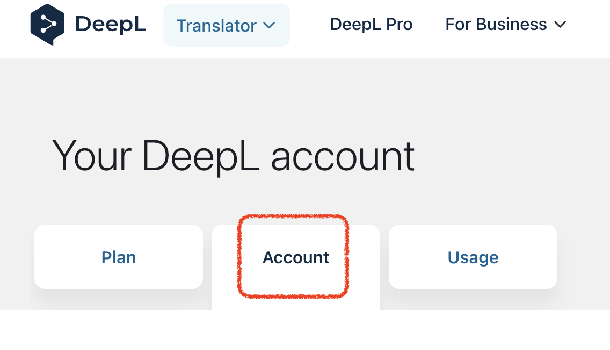
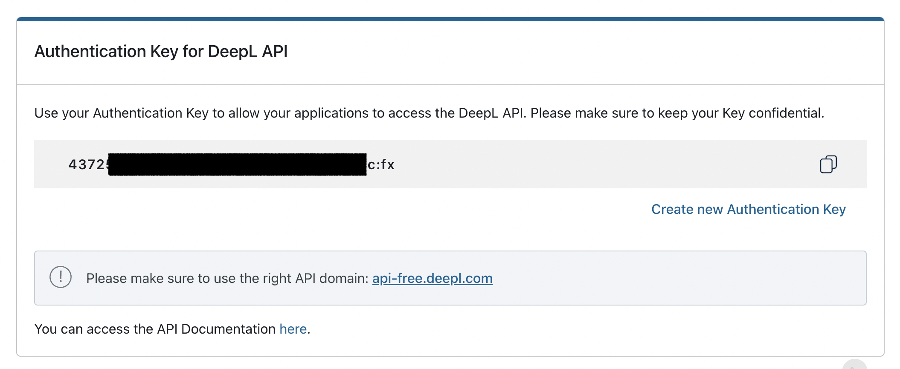
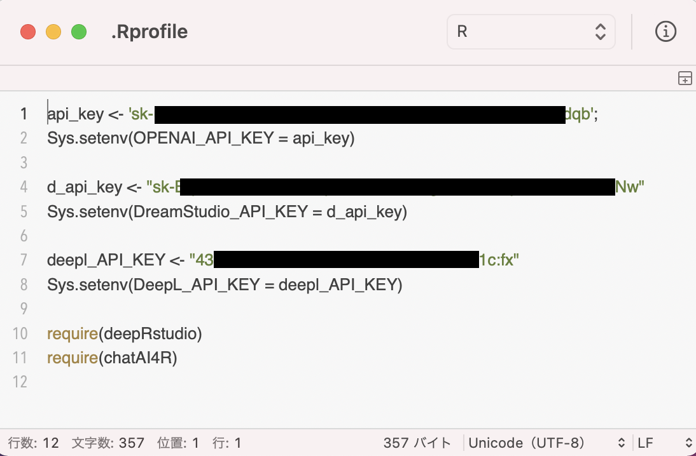

# deepRstudio: Seamless Language Translation in RStudio using DeepL API and rstudioapi

<!-- badges: start -->
[](https://lifecycle.r-lib.org/articles/stages.html#experimental)
[]( https://CRAN.R-project.org/package=deepRstudio)
[](https://cran.r-project.org/package=deepRstudio)
[](https://www.datasciencemeta.com/rpackages)
[](https://kumes.r-universe.dev)
[](https://kumes.r-universe.dev)
<!-- badges: end -->

[GitHub/deepRstudio](https://github.com/kumeS/deepRstudio)

## Description

Enhancing cross-language compatibility within the RStudio environment and supporting seamless language understanding, 
the deepRstudio package leverages the power of the 'DeepL' API 
(see <https://www.deepl.com/docs-api>) to enable seamless, fast, accurate, and affordable translation of code comments, documents, and text. 
This package offers the ability to translate selected text into English, 
as well as from English (EN) into various languages, namely Japanese (JA), Chinese (ZH), Spanish (ES), 
French (FR), Russian (RU), Portuguese (PT), and Indonesian (ID). 
With much of the text being written in English, the emphasis is on compatibility from English. 
It is also designed for developers working on multilingual projects and data analysts collaborating with international teams, 
simplifying the translation process and making code more accessible and comprehensible to people with diverse language backgrounds. 
This package uses 'rstudioapi' package and 'DeepL' API, and is simply implemented, executed from addins or via shortcuts on RStudio. 
With just a few steps, content can be translated between supported languages, promoting better collaboration 
and expanding the global reach of work.

The functionality of this package works only on RStudio using rstudioapi.

DeepL API Docs : [https://www.deepl.com/docs-api](https://www.deepl.com/docs-api)

**To obtain your DeepL API key, you must register for an account at the DeepL website. 
You can register for a free account. This package is built for use with the free version of the Web API.**

## Demo video

- [deepRstudio demo v1 on YouTube](https://youtu.be/fMtxS6zK25A)

- [deepRstudio demo v2 on YouTube (02-SEP-2023)](https://youtu.be/-aDXhduiXDI?si=NJ9pFp52eh7Xr4QX)

## Installation of the deepRstudio package

### 1. Start R / RStudio console.

### 2. Run the following commands in the R console:

#### CRAN-version installation

```r
# CRAN-version installation
install.packages("deepRstudio")
library(deepRstudio)
```

Note: Once restart R (Restart R on the Session or .rs.restartR()) is recommended.

#### Dev-version installation

```r
#v0.0.5
devtools::install_github("kumeS/deepRstudio", ref = "v0.0.5")
library(deepRstudio)
```

Note: Once restart R (Restart R on the Session or .rs.restartR()) is recommended.

### 3. Set the API key according to DeepL Web API.

Please register for a membership (either free or paid) on the DeepL website (https://www.deepl.com/docs-api) to obtain your API key.

**Step 1:** log in to the DeepL website.

<div align="center">

</div>

**Step 2:** click on the Account item.

<div align="center">

</div>

**Step 3:** Scroll down in the Account section and you will see your DeepL API key.

<div align="center">

</div>

**Note: DeepL API Free plan offers free translation of up to 500,000 words/characters per month.**

```r
# Set your key for the DeepL API
Sys.setenv(DeepL_API_KEY = "Your API key")
```

Create an .Rprofile file in your home directory and add your API key (using the code above) into it.

```{r}
# Create a file
file.create("~/.Rprofile") 

# [MacOS X] Open the file and edit it
system(paste("open ~/.Rprofile"))
```

Note: Please be aware of newline character inconsistencies across different operating systems.

Here is an example of `.Rprofile` configuration.

<div align="center">

</div>

## Functions in deepRstudio

|Function|Description|Script|
|:---|:---|:---:|
|deepel|DeepL Translation Function|[Script](https://github.com/kumeS/deepRstudio/blob/main/R/deepel.R)|
|deepel_from_EN|Translate English Text to Other Languages via DeepL API in your clipboard|[Script](https://github.com/kumeS/deepRstudio/blob/main/R/deepel_from_EN.R)|
|deepel_rstudioapi_2EN|Translate Selected Text to English via DeepL API (as RStudio Addins)|[Script](https://github.com/kumeS/deepRstudio/blob/main/R/deepel_rstudioapi_2EN.R)|
|deepel_rstudioapi_2ZH|Translate Selected Text to Chinese via DeepL API (as RStudio Addins)|[Script](https://github.com/kumeS/deepRstudio/blob/main/R/deepel_rstudioapi_2ZH.R)|
|deepel_rstudioapi_2ES|Translate Selected Text to Spanish via DeepL API (as RStudio Addins)|[Script](https://github.com/kumeS/deepRstudio/blob/main/R/deepel_rstudioapi_2ES.R)|
|deepel_rstudioapi_2FR|Translate Selected Text to French via DeepL API (as RStudio Addins)|[Script](https://github.com/kumeS/deepRstudio/blob/main/R/deepel_rstudioapi_2FR.R)|
|deepel_rstudioapi_2RU|Translate Selected Text to Russian via DeepL API (as RStudio Addins)|[Script](https://github.com/kumeS/deepRstudio/blob/main/R/deepel_rstudioapi_2RU.R)|
|deepel_rstudioapi_2PT|Translate Selected Text to Portuguese (all Portuguese varieties mixed) via DeepL API (as RStudio Addins)|[Script](https://github.com/kumeS/deepRstudio/blob/main/R/deepel_rstudioapi_2PT.R)|
|deepel_rstudioapi_2ID|Translate Selected Text to Indonesian via DeepL API (as RStudio Addins)|[Script](https://github.com/kumeS/deepRstudio/blob/main/R/deepel_rstudioapi_2ID.R)|
|deepel_rstudioapi_2JA|Translate Selected Text to Japanese via DeepL API (as RStudio Addins)|[Script](https://github.com/kumeS/deepRstudio/blob/main/R/deepel_rstudioapi_2JA.R)|
|deepel_rstudioapi_speakInJA|Translate and Speak in Japanese via DeepL API (as RStudio Addins / MacOS X)|[Script](https://github.com/kumeS/deepRstudio/blob/main/R/deepel_rstudioapi_speakInJA.R)|

## License

Copyright (c) 2023 Satoshi Kume. Released under the [Artistic License 2.0](http://www.perlfoundation.org/artistic_license_2_0).

## Cite

Kume S. (2023) deepRstudio: Seamless Language Translation in RStudio using DeepL API and rstudioapi

```
#BibTeX
@misc{Kume2023deepRstudio,
  title={deepRstudio: Seamless Language Translation in RStudio using DeepL API and rstudioapi},
  author={Kume, Satoshi}, year={2023},
  publisher={GitHub}, note={R Package},
  howpublished={\url{https://github.com/kumeS/deepRstudio}},
}
```

## Contributors

- Satoshi Kume
